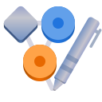

<h1 align="center">
  
  <br>
  Dagger
</h1>

<p align="center">
  <strong>View and edit Graphviz DOT graphs</strong>
</p>

<p align="center">
  <a href="https://github.com/SeaDve/dagger/actions/workflows/ci.yml">
    
  </a>
</p>

Dagger provides facilities to edit and draw graphs specified in the [DOT language](https://graphviz.org/doc/info/lang.html). It is designed to be a simple and intuitive tool for creating and editing graphs, with a focus on the user experience.

The main features of Dagger include the following:
- 🖼️ Live and interactive preview of the graph as you type
- ⏺️ Multiple Graphviz layout engines support
- 📝 Full-featured DOT language editor
- 📦 Export graph to PNG, SVG, and JPEG

## 🏗️ Building from source

### GNOME Builder
GNOME Builder is the environment used for developing this application. It can use Flatpak manifests to create a consistent building and running environment cross-distro. Thus, it is highly recommended you use it.

1. Download [GNOME Builder](https://flathub.org/apps/details/org.gnome.Builder).
2. In Builder, click the "Clone Repository" button at the bottom, using `https://github.com/SeaDve/Dagger.git` as the URL.
3. Click the build button at the top once the project is loaded.

### Meson
```
git clone https://github.com/SeaDve/Dagger.git
cd Dagger
meson _build --prefix=/usr/local
ninja -C _build install
```

## 📦 Third-Party Packages

Unlike Flatpak, take note that these packages are not officially supported by the developer.

### Repology

You can also check out other third-party packages on [Repology](https://repology.org/project/dagger/versions).

## 💝 Acknowledgment

I would also like to acknowledge the open-source software projects, libraries, and APIs that were
used in developing this app, such as GStreamer, GTK, LibAdwaita, `d3-graphviz`, etc.,
for making Dagger possible.
