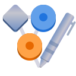
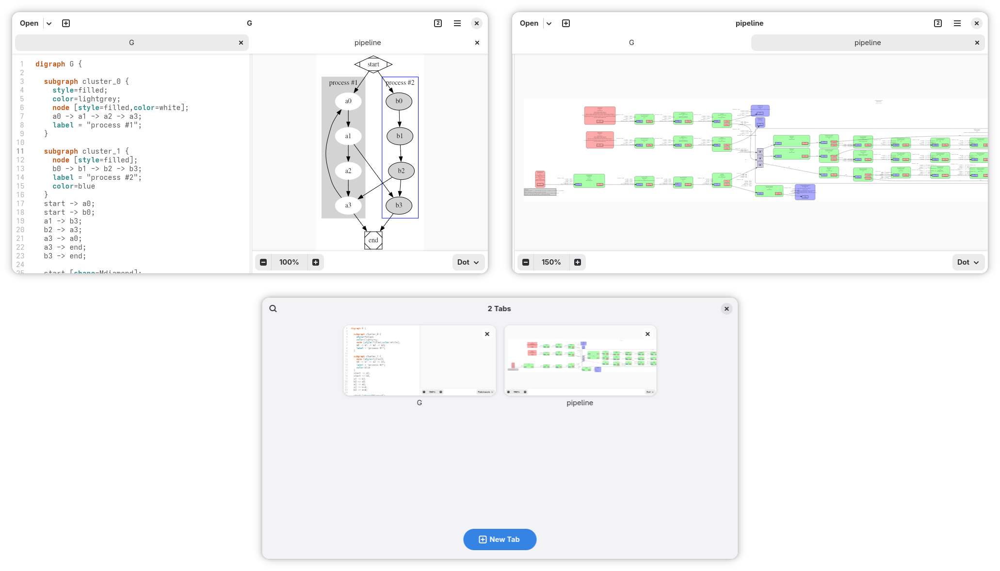

<h1 align="center">
  
  <br>
  Delineate
</h1>

<p align="center">
  <strong>View and edit graphs</strong>
</p>

<p align="center">
  <a href="https://flathub.org/apps/details/io.github.seadve.Delineate">
    
  </a>
  <br>
  <a href="https://seadve.github.io/donate/">
    
  </a>
</p>

<br>

<p align="center">
 <a href="https://hosted.weblate.org/engage/seadve">
    
  </a>
  <a href="https://flathub.org/apps/details/io.github.seadve.Delineate">
    
  </a>
  <a href="https://github.com/SeaDve/Delineate/actions/workflows/ci.yml">
    
  </a>
</p>

<br>

<p align="center">
  
</p>

Delineate provides facilities to edit and draw graphs specified in the [DOT language](https://graphviz.org/doc/info/lang.html). It is designed to be a simple and intuitive tool for creating and editing graphs, with a focus on the user experience.

The main features of Delineate include the following:
- 🖼️ Live and interactive preview of the graph as you type
- ⏺️ Multiple Graphviz layout engines support
- 📝 Fully-featured DOT language editor
- 📦 Export graph as PNG, SVG, or JPEG

## 🏗️ Building from source

### GNOME Builder
GNOME Builder is the environment used for developing this application. It can use Flatpak manifests to create a consistent building and running environment cross-distro. Thus, it is highly recommended you use it.

1. Download [GNOME Builder](https://flathub.org/apps/details/org.gnome.Builder).
2. In Builder, click the "Clone Repository" button at the bottom, using `https://github.com/SeaDve/Delineate.git` as the URL.
3. Click the build button at the top once the project is loaded.

### Meson
```
git clone https://github.com/SeaDve/Delineate.git
cd Delineate
meson _build --prefix=/usr/local
ninja -C _build install
```

## 📦 Third-Party Packages

Unlike Flatpak, take note that these packages are not officially supported by the developer.

### Repology

You can also check out other third-party packages on [Repology](https://repology.org/project/delineate/versions).

## 🙌 Help translate

You can help Delineate translate into your native language. If you find any typos
or think you can improve a translation, you can use the [Weblate](https://hosted.weblate.org/engage/seadve/) platform.

## ☕ Support me and the project

Delineate is free and will always be for everyone to use. If you like the project and
would like to support it, you may donate [here](https://seadve.github.io/donate/).

## 💝 Acknowledgment

I would like to express my gratitude to the open-source software projects, libraries, and APIs that were
used in developing this app, such as GStreamer, GTK, LibAdwaita, `d3-graphviz`, etc.,
for making Delineate possible.

I'd also acknowledge GNOME Text Editor as the session and document architecture is heavily inspired by it,
and also Brage Fuglseth for the name and icon design.

Finally, I would like to thank the [contributors](https://github.com/SeaDve/Delineate/graphs/contributors)
and [translators](https://hosted.weblate.org/engage/seadve/) of the project for helping Delineate
to grow and improve.
